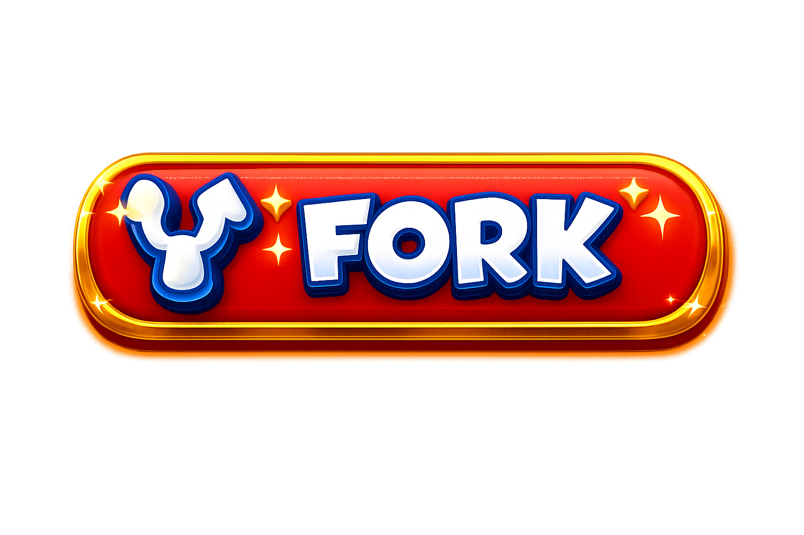
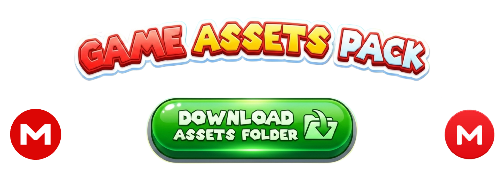
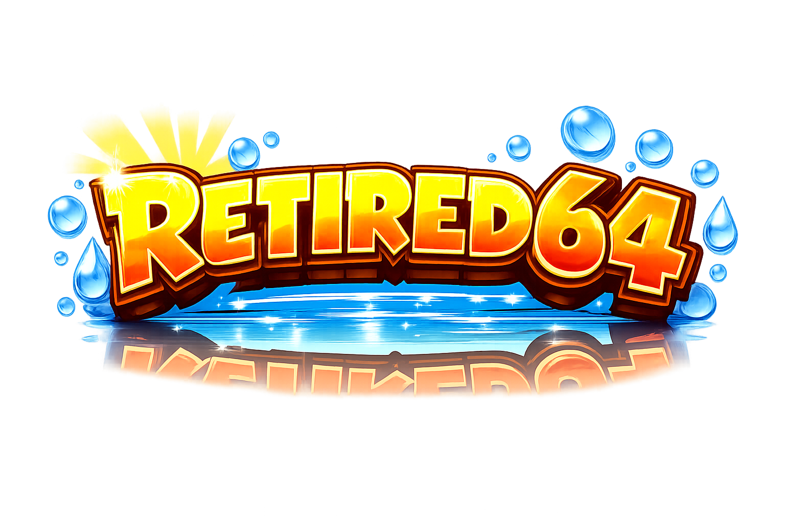

<div align="center">
  
  <br><br>
  
  <a href="https://github.com/retired64/3D-All-Stars-Linux-EDITION/fork">
    
  </a>
    
  
  
  
  
  
  
</div>

## About This Project

Welcome to 3D All Stars Linux EDITION! This program is designed to give you a console-like "Plug & Play" experience with gamepad support, ambient music, and a smooth interface.
**Version:** 1.0 (Pre-release)  
**Platform:** Linux (Ubuntu/Debian tested)  
**Release Page:** [Download Latest Release](https://github.com/retired64/3D-All-Stars-Linux-EDITION/releases)

<div align="center">
  <a href="https://mega.nz/file/qc1iCJzI#xS6NSL1d8-ro8a3xRRbQoNT1IWgo1XMf4ANesjJEuL4" target="_blank">
    
  </a>
</div>

<div align="center">
  
</div>

This isn't just a game menu; it's a **unified command center**.

* **Full Compatibility:** Thanks to the `run` file system, you can launch virtually anything: Emulators (Dolphin, Citra, Desmume), native Linux games, or even custom scripts.
* **Immersive Experience:** Includes background video loading, individual sound effects per game, and optimized navigation.
* **Portability:** If you maintain the folder structure, you can take your collection to any PC with Ubuntu/Debian or other Linux distributions (not yet tested on all distros).

---

## Who Is This For?

This project is ideal for:
- Linux users who want a console-like gaming experience
- Users comfortable with basic file management
- Players who prefer gamepad-first navigation

<div align="center">
  
</div>

For the Launcher to work, you need to place your files following the structure the program expects.

### 1. The Importance of the `run` File

Each game inside the `games/game_name/` folder has a file called `run`.
**What's it for?** It's a "bridge". Instead of the Launcher trying to guess how to open each emulator, the Launcher simply executes `run`, and this script handles opening the emulator with the correct configuration and ROM.

**Example of what a `run` file should look like (for Dolphin/GameCube):**

```bash
#!/bin/sh
cd "$(dirname "$0")" || exit 1
# Calls the emulator and loads the ISO you place in that folder
../../dolphin-emulator/dolphin-emu -b -e MyGame.iso

```

### 2. Where to Put Your Games (ROMs)

For the default configured games, make sure to rename your legally obtained files as follows:

* **Super Mario Galaxy 1:** `games/marioGalaxy/SuperMarioGalaxy.wbfs`
* **Super Mario Galaxy 2:** `games/marioGalaxy2/SuperMarioGalaxy2.wbfs`
* **Super Mario Sunshine:** `games/mariosunshine/SuperMarioSunshine.iso`
* **Mario 3D Land (3DS):** `games/mario3dland/sm3dland.cci` (decrypted version) - rename from .3ds to .cci, it's that simple.
* **Mario 64 DS:** `games/mario64DS/Mario64DS.nds`

> **Note:** If your files have different names, you must edit the corresponding `run` file with a text editor and change the filename at the end of the line.

---

## ➕ How to Add a New Game (Editing `games.json`)

If you want to expand your collection, you need to edit the `games.json` file in the program's root directory. Each game is a block between curly braces `{ }`.

**Steps to add a new one:**

1. **Create the folder:** Create `games/my_new_game/`.
2. **Create the script:** Copy a `run` file from another game and edit it to point to your new binary or ROM.
3. **Register in JSON:** Add an entry like this at the end of the `games.json` file:

```json
{
  "nombre": "Game Name",
  "tipo": "binario",
  "ruta_ejecutable": "games/my_new_game/run",
  "icon": "assets/my_new_game/icon.png",
  "logo": "assets/my_new_game/logo.png",
  "sound": "assets/my_new_game/sound.wav"
}

```

### Art Requirements:

* **Icon:** Game image (recommended icon.png: PNG image data, 1920 x 1920, PNG with transparency).
* **Logo:** Game title (logo.png: PNG image data, 552 x 322, transparent PNG).
* **Sound:** A short `.wav` file that will play when selecting the game.

---

## 🎮 Quick Controls

* **Arrow Keys / Left Stick:** Navigate between games.
* **Enter / A Button:** Launch game.
* **W-S / Right Stick:** Change background music.
* **Hold B Button (5 sec):** Safely close the Launcher.

---

### Gamepad and Emulator Configuration

> **⚠️ Important Note About Controls:**
> Every user has different gamepads. By default, the emulators come pre-configured, but if you need to remap your buttons or adjust the resolution, you must do it manually before starting the Launcher:
> 1. **For Dolphin (GameCube/Wii):**
> Go into the `dolphin-emulator/` folder and run the binary `./dolphin-emu`. There you can configure your gamepads in the "Controllers" menu and it will be saved permanently.
> 2. **For other emulators:**
> Access the corresponding folders (`3ds/`, `nds/`) and run the emulators directly to make your interface and control adjustments.
> 
> 
> Once configured to your liking, close the emulator and open the **3D All Stars Launcher** to enjoy the complete experience!

---

## Installation

### ⚠️ Prerequisite: Git LFS (Large File Storage)

This repository contains pre-compiled binaries (like Dolphin Emulator) that are managed via Git LFS. **If you simply clone the repo without LFS, the emulator will fail to launch with "version not found" errors.**

1. **Install Git LFS on your system:**
* **Ubuntu/Debian:** `sudo apt install git-lfs`
* **Arch:** `sudo pacman -S git-lfs`
* **Fedora:** `sudo dnf install git-lfs`


2. **Clone and Setup:**

```bash
# 1. Clone the repository
git clone [https://github.com/retired64/3D-All-Stars-Linux-EDITION.git](https://github.com/retired64/3D-All-Stars-Linux-EDITION.git)
cd 3D-All-Stars-Linux-EDITION

# 2. Initialize LFS and pull the actual binaries
git lfs install
git lfs pull

# 3. Grant execution permissions to emulators and run scripts
chmod +x dolphin-emulator/dolphin-emu
chmod +x games/*/run

# 4. Set up Python Virtual Environment
python3 -m venv .venv
source .venv/bin/activate

# 5. Install dependencies
pip install -r requirements.txt 

# 6. Launch!
python3 main.py 

```

<div align="center">

**Enjoyed this project? Consider giving it a ⭐**

</div>

### Project Status

This is a pre-release version.
Expect:

* Possible bugs
* Missing features
* Limited distro testing

Community feedback is highly appreciated.

---

## 🔗 Useful Links

* [Report a Bug](https://github.com/retired64/3D-All-Stars-Linux-EDITION/issues/new?labels=bug)
* [Request a Feature](https://github.com/retired64/3D-All-Stars-Linux-EDITION/issues/new?labels=enhancement)
* [Join Discussions](https://github.com/retired64/3D-All-Stars-Linux-EDITION/discussions)

<div align="center">

</div>

*Developed with ❤️ by **Retired64***
[https://www.youtube.com/@Retired64](https://www.youtube.com/@Retired64)

```

```
