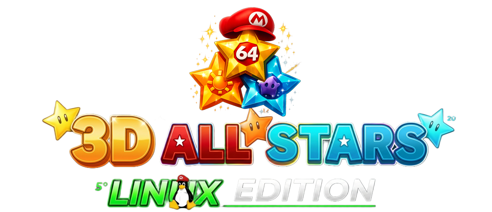

# Guía de Usuario: 3D All Stars Deluxe Launcher (Linux)

¡Bienvenido a 3D All Stars Linux EDITION! Este programa ha sido diseñado para ofrecerte una experiencia de consola "Plug & Play", con soporte para mando, música ambiental y una interfaz fluida.

## El Potencial del Launcher

Este no es solo un menú de juegos; es un **centro de mando unificado**.

* **Compatibilidad Total:** Gracias al sistema de archivos `run`, puedes lanzar prácticamente cualquier cosa: Emuladores (Dolphin, Citra, Desmume), juegos nativos de Linux o incluso scripts personalizados.
* **Experiencia Inmersiva:** Incluye carga de video de fondo, sonidos individuales por juego y navegación optimizada.
* **Portabilidad:** Si mantienes la estructura de carpetas, puedes llevar tu colección a cualquier PC con Ubuntu/Debian o otras Distribuciones LInux Aun no probado.

---

## Cómo configurar tus propios juegos

Para que el Launcher funcione, debes colocar tus archivos siguiendo la estructura que el programa espera.

### 1. La importancia del archivo `run`

Cada juego dentro de la carpeta `games/nombre_del_juego/` tiene un archivo llamado `run`.
**¿Para qué sirve?** Es un "puente". En lugar de que el Launcher intente adivinar cómo abrir cada emulador, el Launcher simplemente ejecuta `run`, y este script se encarga de abrir el emulador con la configuración y la ROM correcta.

**Ejemplo de cómo debe verse un archivo `run` (para Dolphin/GameCube):**

```bash
#!/bin/sh
cd "$(dirname "$0")" || exit 1
# Llama al emulador y carga la ISO que pongas en esa carpeta
../../dolphin-emulator/dolphin-emu -b -e MiJuego.iso

```

### 2. Dónde poner tus juegos (Roms)

Para los juegos configurados por defecto, asegúrate de renombrar tus archivos legalmente obtenidos de la siguiente manera:

* **Super Mario Galaxy 1:** `games/marioGalaxy/SuperMarioGalaxy.wbfs`
* **Super Mario Galaxy 2:** `games/marioGalaxy2/SuperMarioGalaxy2.wbfs`
* **Super Mario Sunshine:** `games/marioshunshine/SuperMarioSunshine.iso`
* **Mario 3D Land (3DS):** `games/mario3dland/sm3dland.cci` (version desencriptada) la renombras de .3ds a .cci asi de facil.
* **Mario 64 DS:** `games/mario64DS/Mario64DS.nds`

> **Nota:** Si tus archivos tienen nombres diferentes, debes editar el archivo `run` correspondiente con un editor de texto y cambiar el nombre del archivo al final de la línea.

---

## ➕ Cómo agregar un juego nuevo (Modificando `games.json`)

Si quieres expandir tu colección, debes editar el archivo `games.json` en la raíz del programa. Cada juego es un bloque entre llaves `{ }`.

**Pasos para agregar uno nuevo:**

1. **Crea la carpeta:** Crea `games/mi_nuevo_juego/`.
2. **Crea el script:** Copia un archivo `run` de otro juego y edítalo para que apunte a tu nuevo binario o ROM.
3. **Registra en el JSON:** Añade una entrada como esta al final del archivo `games.json`:

```json
{
  "nombre": "Nombre del juego",
  "tipo": "binario",
  "ruta_ejecutable": "games/mi_nuevo_juego/run",
  "icon": "assets/mi_nuevo_juego/icon.png",
  "logo": "assets/mi_nuevo_juego/logo.png",
  "sound": "assets/mi_nuevo_juego/sonido.wav"
}

```

### Requisitos de Arte:

* **Icon:** Imagen del juego (se recomienda icon.png: PNG image data, 1920 x 1920, PNG con transparencia).
* **Logo:** Título del juego (logo.png: PNG image data, 552 x 322, PNG transparente).
* **Sound:** Un archivo `.wav` corto que sonará al seleccionar el juego.

---

## 🎮 Controles Rápidos

* **Flechas / Stick Izquierdo:** Navegar entre juegos.
* **Enter / Botón A:** Lanzar juego.
* **W-S / Stick Derecho:** Cambiar música de fondo.
* **Mantener Botón B (5 seg):** Cerrar el Launcher de forma segura.

---


### Configuración de Mandos y Emuladores

> **⚠️ Nota Importante sobre los Controles:**
> Cada usuario tiene mandos diferentes. Por defecto, los emuladores vienen pre-configurados, pero si necesitas remapear tus botones o ajustar la resolución, debes hacerlo manualmente antes de iniciar el Launcher:
> 1. **Para Dolphin (GameCube/Wii):** >    Entra en la carpeta `dolphin-emulator/` y ejecuta el binario `./dolphin-emu`. Allí podrás configurar tus mandos en el menú de "Mandos" y se guardarán para siempre.
> 2. **Para otros emuladores:** >  Accede a las carpetas correspondientes (`3ds/`, `nds/`) y ejecuta los emuladores directamente para realizar tus ajustes de interfaz y control.
> 
> 
> Una vez configurados a tu gusto, ¡cierra el emulador y abre el **3D All Stars Launcher** para disfrutar de la experiencia completa!


_Desarrollado con ❤️ por **Retired64**_ 
[https://www.youtube.com/@Retired64](https://www.youtube.com/@Retired64)
